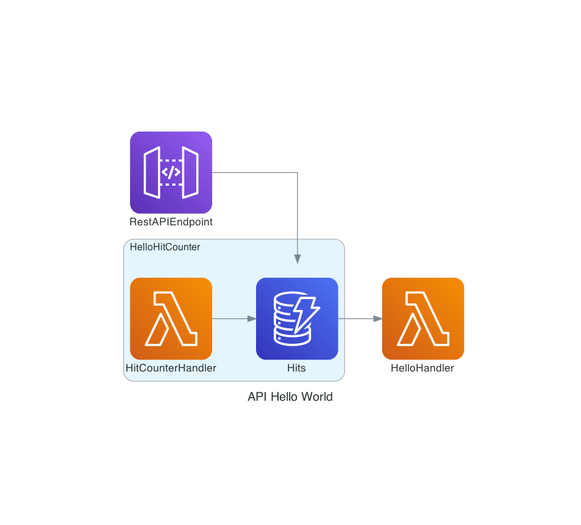

# CDK Tutorial using API Gateway + Lambda

You should explore the contents of this project. It demonstrates a CDK app with an instance of a stack (`cdk_workshop_stack`)
which contains an Lambda function, an API endpoint and a DynamoDB

The `cdk.json` file tells the CDK Toolkit how to execute your app.

## Useful commands

 * `cdk ls`          list all stacks in the app
 * `cdk synth`       emits the synthesized CloudFormation template
 * `cdk deploy`      deploy this stack to your default AWS account/region
 * `cdk diff`        compare deployed stack with current state
 * `cdk docs`        open CDK documentation

## Sources
Created using https://cdkworkshop.com/